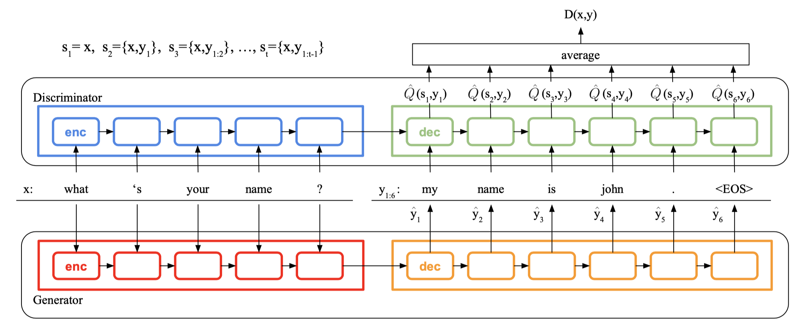

# Condition Sequence Generators

The project is for conditional sequence generation, e.g., chit-chat chatbot.

The programmed training methods includes **cross entropy minimization / maximum likelihood estimation (MLE)**\[2\],  **REINFORCE**\[3\], and several stepwise evaluation methods for sequential GANs, e.g., **SeqGAN \(w/ Monte-Carlo\)**\[4\], **MaliGAN**\[5\], **REGS**\[6\], **the update method of MaskGAN**\[7\], **StepGAN**\[1\].

The usable testing methods includes **argmax**, **softmax samples**, **beam search**, **maximum mutual information**\[8\].

The project is the implementation of our paper:
* [Tuan, Yi-Lin, and Hung-Yi Lee. "Improving conditional sequence generative adversarial networks by stepwise evaluation." IEEE/ACM Transactions on Audio, Speech, and Language Processing 27.4 (2019): 788-798.](https://arxiv.org/abs/1808.05599)
If you find it helpful, please kindly cite the paper.


> The StepGAN Architecture. x is an input message and y1 to y6 are infered output tokens. The details are in the paper.


## Requirements
* Has been tested on from Tensorflow r1.3 to r1.13
* python 3.6
* library
    * `pip3 install numpy argparse`
* modify the path assigned in `run.sh`
* The dataset can be downloaded from [our dataset repository (OpenSubtitles, Counting)](https://github.com/Pascalson/chatbot-data). Feel free to cope with any dataset you prepare, but please make sure the format is consistent with our assigned format.
* The dataset should be placed under directory `./data/`, e.g., `./data/opensubtitles/opensubtitles.txt`. Or you have to check the datapath in the codes.


## Usage
To run the experiments with default parameters:
```
$bash run.sh <GPU_ID> <TEST_TYPE> <MODEL_TYPE> <TASK_NAME>
```
- The argument `<GPU_ID>` is used when you have multiple gpu in your computer. You can use command `nvidia-smi` to check the ID of your GPUs. Otherwise, you can just set `<GPU_ID>` to `0`(use the 1st GPU) or `-1`(use CPU).
- The argument `<TEST_TYPE>` includes `None`, `accuracy`, `realtime_argmax`, `realtime_sample`, `realtime_beam_search`, and `realtime_MMI`, where `None` means the process is **training** and `accuracy` is only usable for the synthetic task (Counting) .
- The argument `<MODEL_TYPE>` can be chose from `MLE`, `SeqGAN`/`MC-SeqGAN`(the Monte-Carlo version), `MaliGAN`/`MC-SeqGAN`(the Monte-Carlo version), `REGS`, `MaskGAN`, and `StepGAN`/`StepGAN-W`. In the experiment of [our paper](https://arxiv.org/abs/1808.05599), `StepGAN` or `StepGAN-W` can perform better.
- The argument `<TASK_NAME>` can be chose from `OpenSubtitles` and `Counting`, or other data/task you prepare.

You can change all the hyper-parameters in `run.sh`. The options are listed in `args.py`.

### Examples

training MLE for Counting
```
$bash run.sh 0 None MLE Counting
```

training REINFORCE for Counting
```
$bash run.sh 0 None REINFORCE Counting
```

training SeqGAN for Counting with `lr=5e-5 lrdecay=0.99 Gstep=1 Dstep=5`
```
$bash run.sh 0 None SeqGAN Counting 5e-5 0.99 1 5
```

testing MLE for Counting
```
$bash run.sh 0 accuracy MLE Counting
```

testing SeqGAN for Counting with `lr=5e-5 lrdecay=0.99 Gstep=1 Dstep=5`
```
$bash run.sh 0 accuracy SeqGAN Counting 5e-5 0.99 1 5
```

testing SeqGAN for OpenSubtitles
```
$bash run.sh 0 realtime_argmax SeqGAN OpenSubtitles
```


## Hyperparameters
For Counting, the suggested hyper-parameters are:

```
    generator learning rate = 5e-5\~1e-4
    discriminator learning rate = 5e-5\~1e-4
    learning rate decay = 0.99\~1.00
    generator training steps = 1
    discriminator training steps = 5
```

For OpenSubtitles, the used hyper-parameters are:

```
    generator learning rate = 1e-3 (or 5e-5 for weighted version)
    discriminator learning rate = 1e-3 (or 5e-5 for weighted version)
    learning rate decay = 1.00
    generator training steps = 1
    discriminator training steps = 5
```


## Program Structures
training / testing criterions:
* `main.py`
* `args.py`
* `train_mle.py`
* `train_gan_n_rl.py`
* `train_utils.py`
* `test.py`

models:
* `seq2seq_model_comp.py`
* `critic.py`
* `units.py`

data processing:
* `data_utils.py`

## References
1. [Tuan, Yi-Lin, and Hung-Yi Lee. "Improving conditional sequence generative adversarial networks by stepwise evaluation." IEEE/ACM Transactions on Audio, Speech, and Language Processing 27.4 (2019): 788-798.](https://arxiv.org/abs/1808.05599)
2. [Vinyals, Oriol, and Quoc Le. "A neural conversational model." arXiv preprint arXiv:1506.05869 (2015).](https://arxiv.org/abs/1506.05869)
3. [Ranzato, Marc'Aurelio, et al. "Sequence level training with recurrent neural networks." ICLR 2016.](https://arxiv.org/abs/1511.06732)
4. [Yu, Lantao, et al. "Seqgan: Sequence generative adversarial nets with policy gradient." AAAI 2017.](https://www.aaai.org/ocs/index.php/AAAI/AAAI17/paper/viewPaper/14344)
5. [Che, Tong, et al. "Maximum-likelihood augmented discrete generative adversarial networks." arXiv preprint arXiv:1702.07983 (2017).](https://arxiv.org/abs/1702.07983)
6. [Li, Jiwei, et al. "Adversarial Learning for Neural Dialogue Generation." EMNLP 2017.](https://arxiv.org/abs/1701.06547)
7. [Fedus, William, Ian Goodfellow, and Andrew M. Dai. "MaskGAN: better text generation via filling in the\_." ICLR 2018](https://arxiv.org/abs/1801.07736)
8. [Li, Jiwei, et al. "A Diversity-Promoting Objective Function for Neural Conversation Models." NAACL-HLT  2016.](https://arxiv.org/abs/1510.03055)
